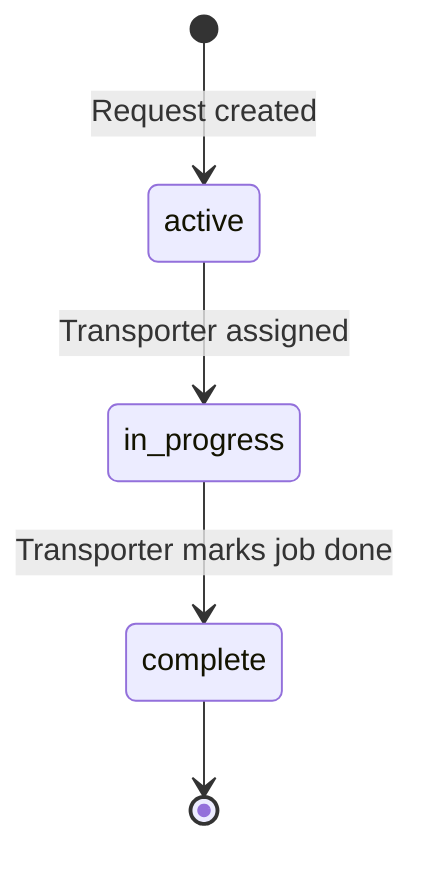
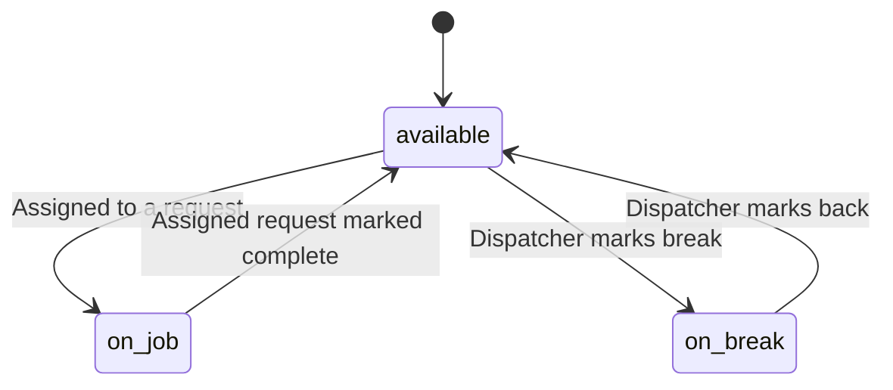
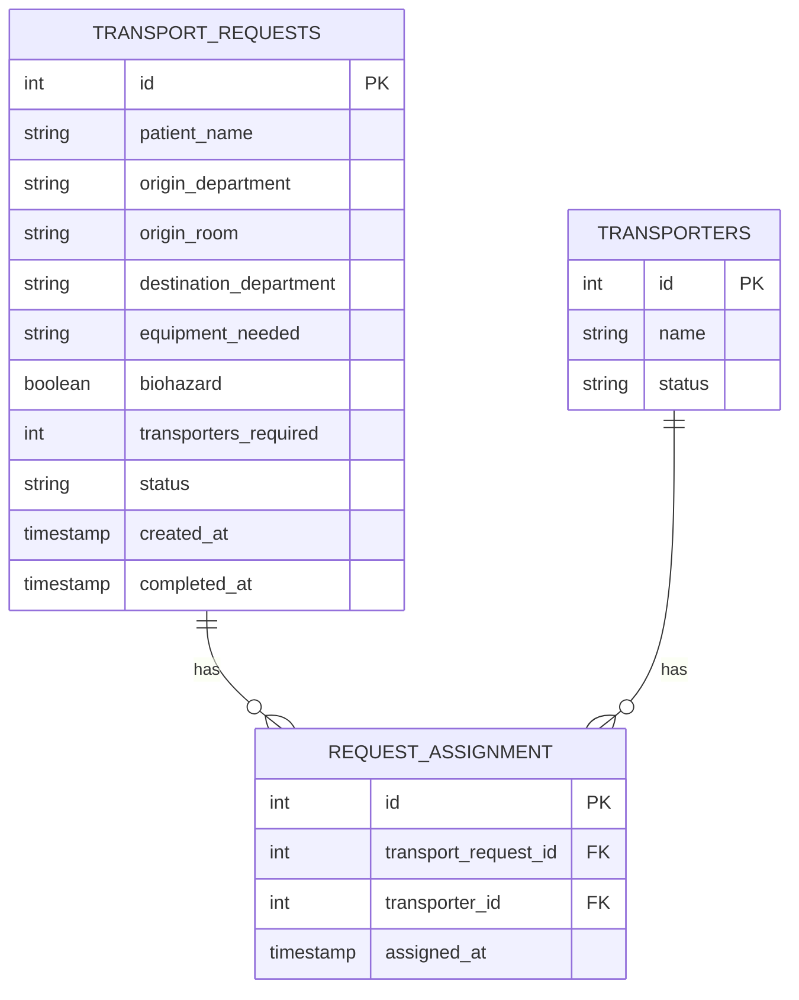

# DIAGRAMS

This file holds the visual and structural references for how a transport request moves through Vectris, how the three tables relate to each other, and what each dashboard screen shows.

## Transport Request Status

A request only moves one direction. Nothing loops back once it starts.

## Transporter Status

A transporter goes on a job and comes back automatically once that job is marked complete. A dispatcher can also pull someone into a break by hand.

## Entity Relationships

## Dashboard Screens

Four screens, drawn from the wireframe I built for this project and checked against entities.md and decisions.md.

- **Dashboard:** A header, then three panels: the active request queue sorted oldest first, the list of available transporters, and a delayed panel showing anything still active past a set time threshold.

- **Create Request:** Patient name, origin department (dropdown), origin room (text), destination department (dropdown), equipment needed (dropdown), biohazard (checkbox), transporters required (number, defaults to 1), and a submit button.

- **Assign Transporter:** The selected request's patient information next to a list of available transporters, with a button to assign one.

- **Job Detail:** Patient name, department, assigned transporter, and current status, with a button to update the status.

No priority field anywhere. No status history timeline. I cut both once I checked the wireframe against decisions already made. The queue's sort order is the only priority signal Vectris has, and nothing tracks status changes over time.
